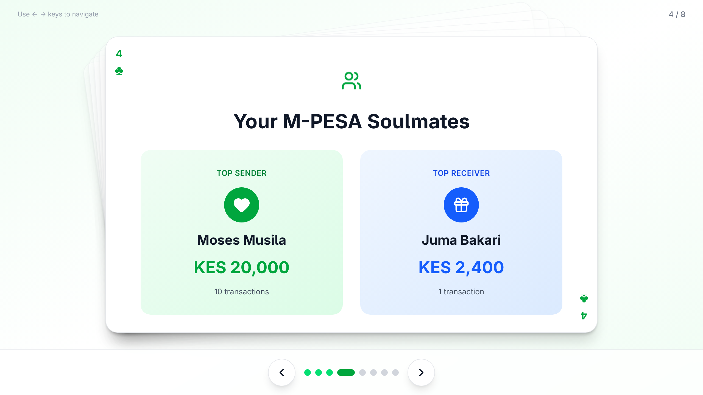

# M-PESA Wrapped

**Your M-PESA story, beautifully told.**
M-PESA Wrapped takes your M-PESA statement and turns it into a beautiful story about your spending habits.

---


<p align="center">
  
  
</p>

---

## What It Does

Upload your M-PESA statement PDF, and discover:

- **Your Money Movement** — See how much came in vs went out
- **Your M-PESA Soulmates** — Find out who you send and receive money from the most
- **When You Spend** — Are you a morning spender or a night owl?
- **Your Spending Week** — Which day of the week hits your wallet the hardest?
- **Weekday vs Weekend** — Do you spend more during the week or on weekends?

All presented in a swipeable, visual story format.

---

## How It Works

1. **Get your M-PESA statement** from the `M-PESA app` or `USSD *334#`
2. **Upload the PDF** to M-PESA Wrapped
3. **Enter the password** (if your statement is password-protected)
4. **Swipe through your story** and discover your spending patterns


---


## Try It Out

🌐 **Live Demo:** [mpesa-wrap.vercel.app](https://mpesa-wrap.vercel.app)

---

## Run It Locally
1. Clone the repo
```bash
git clone https://github.com/KagemaNjoroge/mpesa-wrap.git
```

2. **Run the Backend (API):**
```bash
cd api
uv sync && source .venv/bin/activate
fastapi dev app.py

```

3. **Frontend (Website):**
```bash
cd client
npm i
npm run dev
```
3. **Use Docker Altenatively**  
probably an overkill, sorry
